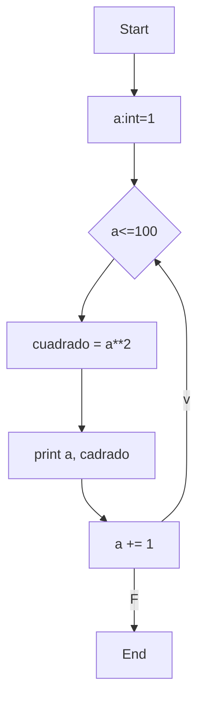
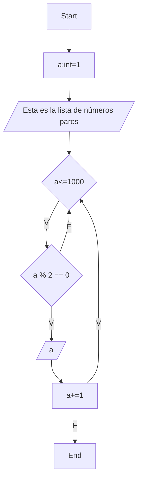
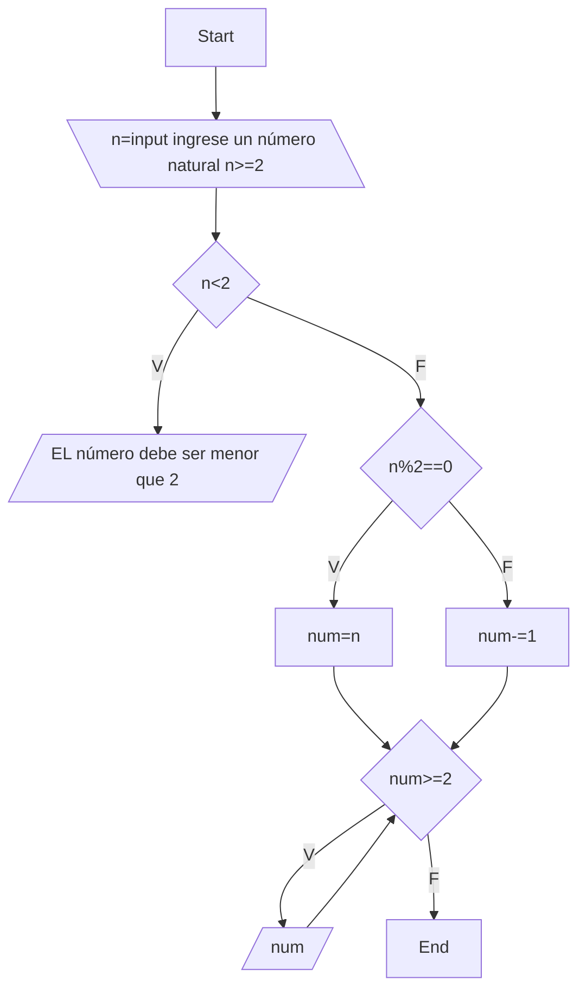

# Diosmiosenorayudame
#7 Un retico bien bonito 
# Punto 1
Imprimir un listado con los números del 1 al 100 cada uno con su respectivo cuadrado. Para este punto use un ciclo while sumando a una variable cada vez 1 hasta que fuera menor que 100 y definí otra variable en que es el cuadrado del número.
```python
#Numeros_100
a = int = 1
while a <= 100:
    cuadrado =  a**2
    print(a, cuadrado, sep = " , ")
    a += 1
```
Diagrama de flujo:

ver documento: [#Numeros_100.py](/#Numeros_100.py)
# Punto 2
Imprimir un listado con los números impares desde 1 hasta 999 y seguidamente otro listado con los números pares desde 2 hasta 1000.
* Para este punto defini dos funciones, una en la que se definen los números pares hasta el 999 y la otra donde se definen los pares hasta 1000, cada una con un ciclo while y usando el operador %
```python
#chevereynotanchevere
def impares():
    a = 1
    print("Esta es la lista de numeros impares")
    while a <= 999:
        if (a % 2) != 0:
            print(a)
        a += 1
def pares():
    a = 2
    print("Esta es la lista de numeros pares")
    while a <= 1000:
        if (a % 2) == 0:
            print(a)
        a += 1

impares()
pares()
```
* Diagrama de flujo función *impares()*:

* Diagrama de flujo función *pares()*:

Ver documento: [#chevereynotanchevere.py](/#chevereynotanchevere.py)
# Punto 3
Imprimir los números pares en forma descendente hasta 2 que son menores o iguales a un número natural n ≥ 2 dado
* En este punto lo que hice fue definir una función con el ciclo ´do-while´ para que el ususario no pueda ingresar un número menor que 2. Posteriormente defino la variable *num* teniendo en cuenta si el número es par o impar, si es par es el mismo, si es impar se le resta 1. Depués con un ciclo ´while´ le pido al codigo que imprima n cada dos númeors mientras que sea menor que el numero inicial. Por último defino n cómo un número que ingresa el usuario y despues hago el llamado a la función.
```python
def imprimir_pares_descendentes(n):
    if n < 2:
        print("El número debe ser mayor o igual a 2.")
    num = n if n % 2 == 0 else n - 1  
    while num >= 2:
        print(num)
        num -= 2


n = int(input("Ingrese un número natural (n ≥ 2): "))
print("Números pares descendentes hasta 2:")
imprimir_pares_descendentes(n)
```
*Diagrama de flujo: 

Ver documento:[pares.py](/pares.py)
# Punto 4
En 2022 el país A tendrá una población de 25 millones de habitantes y el país B de 18.9 millones. Las tasas de crecimiento anual de la población serán de 2% y 3% respectivamente. Desarrollar un algoritmo para informar en que año la población del país B superará a la de A.
* Para este punto lo primero fue definir todads las variables, población actual, tasa de crecimiento de cada uno de los paises y el año de inicio. Posterirmente sen un ciclo ´while´ mientras que la población de A es mayor que la de B, se definen nuevamente las variables de poblaciones sumandoles cada vez el 2% o 3% respectivamente, y al mismo timepo se le suma 1 al año. Cuando ya no se cumpla la condición el porgramá imprimirá el año en que esto pasó.
```python
#Gentecita
poblacion_pais_A= 25  # en millones
poblacion_pais_B = 18.9  # en millones
tasa_crecimiento_A = 0.02  
tasa_crecimiento_B = 0.03  
año = 2022
while poblacion_pais_A>poblacion_pais_B:
    poblacion_pais_A += poblacion_pais_A*tasa_crecimiento_A
    poblacion_pais_B += poblacion_pais_B*tasa_crecimiento_B
    año = año +1
    
print(f"En el año {año} la población del país B superará a la población del país A")
```
Ver documento:[#Gentecita.py](/#Gentecita.py)
# Punto 5
Imprimir el factorial de un número natural n dado}
* Lo primero que hice fue definir ´n´ como una variable que el ususario puede ingresar, y ´factorial´ cómo 1, para usarlo como auxiliar. Después en un ciclo´while´ mientras que ´n´ sea mayor que 1 se actualiza la variable ´factorial´ como la multiplicación de si mismo con ´n´
que posteriormente es inicializada como ´n-1´, y así cada vez el numero ´factorial´ se va a multiplicar con el pequeño anterior.
```python
n = int(input("Ingrese un número natural para calcular su factorial: "))
factorial = 1
while n > 1:
     factorial *= n
     n -= 1
print(f"El numero factorial de {n} es {factorial}")
```
Ver documento: [#factorial.py](/#factorial.py)
# Punto 6
Implementar un algoritmo que permita adivinar un número dado de 1 a 100, preguntando en cada caso si el número es mayor, menor o igual.
* Para iniciar de ´random´ importé todas las funciones, ya que seránecesario usar ´randint´, una fnción que escoge un npumero al azar en un rango determinado. Defíni 4 variables, maximo, minimo, x que es el número que se debe adivinar y la bandera. Con cliclo while cuya condición es el contrario de una bandera para que se ejecute sin una condición determinada, defino otra variable que va a ser la pregunta que se le hace al usuario con un número al azar cada vez que itere el ciclo. Posteriormente con un ciclo if se actualizan las variables máximo y mínimo cómo el último número que se dio al azar, esto para que cada vez que el programa pregunte, el rango de posibilidades sea más pequeño.
```python
from random import*

def adivinar_numero():
    x=input("Ingrese un npumero del 1 al 100: ")
    min_numero = 1
    max_numero = 100
    bandera = False
    
    while not bandera:
        a = randint(min_numero, max_numero)
        respuesta = input(f"¿Es el número mayor, menor o igual que {a}?:  ")
        
        if respuesta == "mayor":
            min_numero = a 
        elif respuesta == "menor":
            max_numero = a 
        elif respuesta == "igual":
            print(f"Tu número es {a}")
            break 
            

adivinar_numero()
```
Ver documento: [Adivina_Adivinador.py](/Adivina_Adivinador.py)
# Punto 7
Implementar un programa que ingrese un número de 2 a 50 y muestre sus divisores.
* En este ciclo while la condición es que a que es el auxiliar sea menor que n (número ingresado por el usuariio) y además que n se encuentre entre 2 y 50. a se actualiza como a+1 y si la divición de n entre a en igual a 0 entoces se imprime a que es un divisor de n.
```python

#2-50
n=float(input("Ingrese un número del 2 al 50: "))
a= 0
while (a<n and 2<=n<=50):
  a+=1
  if n%a!=0:
    continue
  print(f"Los divisores de {n} son: {a}")
```
Ver documento:  [2-50.py](/2-50.py)
# Punto 8 
Implementar el algoritmo que muestre los números primos del 1 al 100
* Definí dos funciones:
*  Primero la función que es capaz de decir si un número es primo o no, esto con un ciclo while en el que el auxiliar (a) al cuadrado sea menor que el número en cuestión, ya que solo es necesario provar los divisores hasta el cuadrado anterior al número. Si se encuntra un divisor, la función va a ser falsa, pero por otro lado si no se encuentra un divisor la función va a ser verdadera.
* Y para poder imprimir eso, se crea una función en la que definimos una variable como 1, y posteriormente se utiliza una iteración hasta que esa variable sea 100, y por último con un ciclo if se verifica si la función anterior se cumple para el número, si sí, se imprime si no, se actualiza la variable (num+=1).
```python
#Es primo o no 
def es_primo(numero):
    i = 2
    while i*i <= numero:
        if numero % i == 0:
            return False
        i += 1
    return True

#imprimir los numeros 
def imprimir_numeros_primos():
    num = 1
    while num <= 100:
        if es_primo(num):
            print(num)
        num += 1

print("Números primos del 1 al 100:")
imprimir_numeros_primos()
```
Ver documento:[primitos.py](/primitos.py)


    


